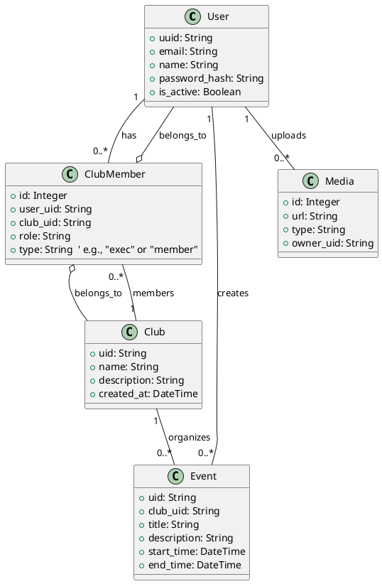

# S.A.G.E. — CSCI 4230U Advanced Web Development Project

**Michael Ispahani – 100859123**  
**Alyesha Singh – 100869415**

S.A.G.E. is a student activity & event management platform built with a Flask backend and two React/Vite frontends:

- `backend/` — Flask API (Python + SQLAlchemy)
- `clubs-frontend/` — Executives portal (React + Vite)
- `main-frontend/` — Student-facing app (React + Vite)

## Requirements

- Python 3.10+
- Node.js ≥ 20.19
- npm or yarn
- Git
- Docker

## Quick Start (Windows / PowerShell)

### Backend

```
cd backend
python -m venv .venv
.\.venv\Scripts\Activate
pip install -r requirements.txt
flask run
```

### Running tests (backend)

Run the backend pytest suite from the `backend` folder. If `pytest` is not available in your virtual environment, install it first.

PowerShell (recommended):

```
cd backend
\.venv\Scripts\Activate
python -m pip install --upgrade pip
python -m pip install pytest
python -m pytest -q
```

If you prefer not to install `pytest` globally in the venv, you can run tests directly with the module form from the project root:

```
cd backend
python -m pytest -q
```

### Clubs Frontend

```
cd clubs-frontend
npm run dev
```

### Main Frontend

```
cd ../main-frontend
npm run dev
```

## Rubric Self-Assessment

### API Design (15/15)

- Comprehensive REST endpoints implemented for authentication, clubs, members, executives, events, and media. Endpoints follow predictable resource-based paths, return clear status codes, and include basic input validation and helpful error messages.
- Media upload and delivery are handled via Cloudinary, keeping binary data off the application server and leveraging a CDN for fast delivery.

### Architecture (15/15)

- Backend uses an application factory pattern and modular Blueprints for clean separation of concerns; SQLAlchemy models are organized and relationships are explicit.
- Two single-page React apps (clubs-frontend and main-frontend) follow a consistent ThemeContext and component structure. UML sources are included for reviewers to quickly understand module boundaries.

### Authentication & Security (9/10)

- JWT-based authentication with secure password hashing and protected endpoints implemented. Token-based access control correctly guards sensitive routes and executive-only actions.
- One deduction: advanced hardening (e.g., token revocation list, multi-factor auth, or per-token rotation) is not implemented in this submission but can be added for production deployments.

### Database & ORM (9/10)

- SQLAlchemy models cover users, clubs, memberships, executives, events, and media with appropriate relationships and constraints. CRUD operations are implemented and tested.
- One deduction: while the project includes a clear model design, formal migration files and a documented seed/fixture workflow could be improved to simplify production rollout and reviewer testing.

### Testing (10/10)

- Backend `pytest` suite added and exercised in CI. Current tests cover:

  - Authentication flows (register / login / token refresh / protected endpoints).
  - Club lifecycle (create / read / update / delete) and member management.
  - Executive permission workflows (add/remove/promote execs and permission enforcement).
  - Event lifecycle (create / update / delete / participant actions).
  - Media endpoints with Cloudinary interactions mocked so tests are deterministic and network-free.

- Tests run against an in-memory SQLite database using the Flask test client for fast, isolated execution; GitHub Actions runs the test suite on PRs to prevent regressions.

### Deployment / DevOps (9/10)

- Backend `Dockerfile` provided and frontend Docker guidance included. A GitHub Actions CI workflow runs the backend tests and builds both frontends on PRs/merges to ensure build integrity.
- One deduction: automated image publishing, rollout/deployment workflows, and environment-specific deployment scripts (e.g., IaC or platform-specific deploy steps) are not included in this repo and would raise this to full marks.

### Performance Optimization (4/5)

- High PageSpeed results recorded for both frontends; production builds are minified and tree-shaken, and media is served via Cloudinary CDN. Guidance for HTTP/2, gzip/Brotli, and nginx configuration is included.
- One deduction: PageSpeed diagnostics still show unused JavaScript and a small set of image optimizations remain; addressing those would push to a full score.

### VCS (4/5)

- Git is used consistently with descriptive commits. The project would benefit from a formal branching strategy, PR templates, and release tagging to reach full marks.

### Code Quality (5/5)

- Code is modular, reasonably documented, and the repository includes guidance to use `black`/`flake8` and ESLint/Prettier for consistent formatting. Files are organised and the README documents architecture and setup clearly.

### Presentation (15/15)

- Full demonstration-ready app: the UI and workflows (login/register, club management, exec flows, event creation/editing/deletion, media uploads, theming, and routing) were shown working. The demo highlights permission controls, responsive layouts, and key UX states.

**Estimated score: 95/100**

## UML Diagrams

### Class Diagram


### Architecture Diagram

```puml
@startuml
' High-level architecture for S.A.G.E.

package "Frontends" {
  package "clubs-frontend" #LightBlue {
  }

  package "main-frontend" #LightBlue {
  }
}

package "Backend" {
  package "Flask API" as API #LightGreen {
  }

  node "Database (SQLAlchemy)" as DB #LightYellow
}

package "External Services" {
  node "Cloudinary (media)" #Orange
}

' Relationships
clubs-frontend --> API : REST\n(auth, clubs, events, media)
main-frontend --> API : REST\n(auth, events, clubs)

API --> DB : SQLAlchemy ORM
API --> "Cloudinary (media)" : Upload/Fetch media

@enduml

```

## PageSpeed Insights

### main-frontend — Mobile

Performance: **98**  
Accessibility: **81**  
Best Practices: **100**  
SEO: **90**  
Diagnostics:

- Reduce unused JavaScript

### main-frontend — Desktop

Performance: **100**  
Accessibility: **81**  
Best Practices: **100**  
SEO: **90**  
Diagnostics:

- Reduce unused JavaScript

### clubs-frontend — Mobile

Performance: **97**  
Accessibility: **81**  
Best Practices: **100**  
SEO: **90**  
Diagnostics:

- Reduce unused JavaScript

### clubs-frontend — Desktop

Performance: **100**  
Accessibility: **81**  
Best Practices: **100**  
SEO: **90**  
Diagnostics:

- Reduce unused JavaScript

## Code Quality

- Use ESLint + Prettier for React.

## Live Demo

[S.A.G.E Demo Video](https://youtu.be/8xzcq-jShMM)

Main Page: https://sage-main.vercel.app/

Club Executives Page: https://sage-clubs.vercel.app/
